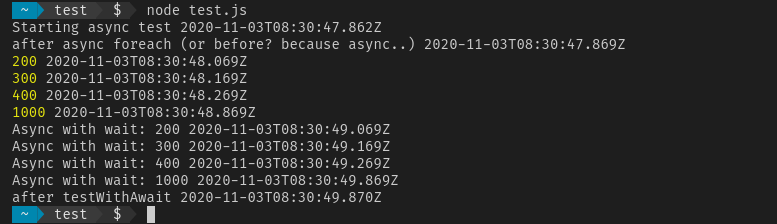

# Async

Copy to a file (e.g test.js) and run with:
node test.js

Result should be something like this:

PS: To clarify. Both loops run at the same time, to test remove the Math.max bit of the second loop) but the log on line 69 is delayed because it is wrapped in a function which uses await to make sure that the loop has finished before (allowing for sync-like programming)
